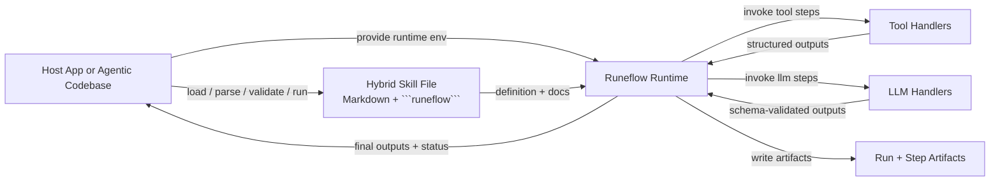

# Runeflow

Runeflow is a tiny prototype runtime for hybrid AI skills.

A Runeflow skill combines:

- Markdown for human guidance
- a fenced `runeflow` block for executable structure
- JSON artifacts for run and step outputs

The goal is to let a host application execute a skill deterministically without asking the LLM to interpret the workflow language.

## What Problem It Solves

Most skills today are just prompt text loaded into model context. That is useful for guidance, but weak for execution:

- control flow is implicit
- tool use is loosely defined
- retries and failure handling are ad hoc
- outputs are hard to validate
- runs are hard to inspect afterward

Runeflow keeps the human-facing Markdown, but moves execution semantics into the runtime.

## Runeflow Vs Plain Skills

Plain skill:

- the host loads instructions into the model
- the model informally decides what steps to follow
- tool usage and output shape rely on prompt discipline

Runeflow skill:

- the host loads and runs a hybrid file
- the runtime owns sequencing, branching, retries, fallback, and validation
- the LLM is used only inside bounded `llm` steps
- each run writes artifacts so behavior is inspectable

The important difference is not whether the LLM can see the text. It can. The difference is that the text is no longer the execution contract.

## Performance Benchmarks

Our evaluation harness (comparing Runeflow against raw Zero-Shot AI commands) reveals astronomical efficiency gains for orchestration-heavy tasks (e.g. MCP integration, tool discovery):

- **Token Compression (-84%)**: Because Runeflow executes tool tracking and auth checks natively in Javascript, it entirely strips dense orchestration instructions from the LLM prompt. In the `adyntel-automation` benchmark, Runeflow compressed an 810-token input down to just 128 tokens.
- **Latency Acceleration (3x Faster)**: Removing the prompt bloat allows models like `gpt-4o` to reduce time-to-first-token and complete executions up to 3x faster (e.g. dropping from 1.8s down to 596ms). 
- **Bypassing the "Zero-Shot Trap"**: Raw prompts frequently fall into infinite "tool discovery" loops or explicitly refuse to execute operations without querying tool schemas first. Runeflow's deterministic runtime completely eliminates this failure mode.

Third-party inference APIs (including Cerebras) can **rate-limit** burst traffic. When replicating benchmarks locally, run the eval harnesses with a pause between baselines, for example `--delay-ms 8000` on `eval/adyntel-automation.js`, so raw and Runeflow runs do not back-to-back against the same quota.

*See the full [Benchmark Report](./benchmark_report.md) for data breakdowns across multiple providers (OpenAI, Cerebras).*

## Architecture

Runeflow is meant to be run by a host application, which may be a CLI, backend, or agentic codebase.



- Host: decides when to run a skill and provides tools, LLM handlers, cwd, credentials, and repo context.
- Runeflow runtime: owns execution semantics.
- LLM handler: produces bounded outputs for a single `llm` step.

## Minimal Shape

````md
---
name: prepare-pr
description: Prepare a pull request draft.
version: 0.2
inputs:
  base_branch: string
outputs:
  title: string
  body: string
---

# Prepare PR

Operator guidance lives in Markdown.

```runeflow
step current_branch type=tool {
  tool: git.current_branch
  out: { branch: string }
}

step draft_pr type=llm {
  prompt: "Draft a PR for {{ steps.current_branch.branch }} targeting {{ inputs.base_branch }}."
  input: { branch: steps.current_branch.branch }
  schema: { title: string, body: string }
}

output {
  title: steps.draft_pr.title
  body: steps.draft_pr.body
}
```
````

## Supported Model

Runeflow is intentionally narrow:

- ordered execution
- `tool` steps
- `llm` steps with schema validation
- `transform` steps (JavaScript expressions over resolved `input`, validated against `out`)
- `branch` steps with explicit `then` and `else`
- `retry`
- `fallback`
- terminal `fail`

It does not aim to be a general orchestration engine.

## Reusable blocks

A **block** is a named step template with a full contract (`kind`, schemas, prompts, tool id, etc.). A **step** references it with `type=block` and a `block: name` field; step-level fields **override** the template (for example `next`, `prompt`, or `input`).

```runeflow
block greet_template type=llm {
  prompt: "Reply with a short greeting for {{ inputs.name }}."
  schema: { greeting: string }
}

step greet type=block {
  block: greet_template
}

output {
  greeting: steps.greet.greeting
}
```

Blocks are expanded at parse time (same file only for now). Template kinds allowed: `tool`, `llm`, and `transform` (not `branch`). See [examples/block-demo.runeflow.md](./examples/block-demo.runeflow.md) and `npm run validate:block-demo`.

**Later**: importable block libraries, versioning, and optional registry-backed block ids.

## Trust model

- **Skill files** define `transform` expressions and workflow structure—treat them as **trusted code** in the host process.
- **`transform`** runs via `new Function` (full host JS). Set **`RUNEFLOW_DISABLE_TRANSFORM=1`** to fail runs that contain transform steps.
- **`runeflow run --runtime ./path.js`** loads that module with Node `import()`—only load **trusted** runtimes.
- Built-in **`file.exists`** resolves paths under the run **cwd**; absolute paths are resolved by Node and can read outside the project—avoid passing untrusted paths into tools.

## Roadmap (next)

- Block **imports** / shared libraries across files.
- Stronger **sandboxing** or restricted transform dialect for untrusted skills.
- Optional **cwd-only** filesystem policy for builtins.

Deeper execution roadmap: [plans/PLAN.md](./plans/PLAN.md). Evaluation notes: [plans/EVAL.md](./plans/EVAL.md).

## Quickstart

```bash
npm install
npm test
node ./bin/runeflow.js validate ./examples/open-pr.runeflow.md
node --env-file=.env ./bin/runeflow.js run ./examples/open-pr.runeflow.md --input '{"base_branch":"main"}' --runtime ./examples/open-pr-runtime.js
```

## CLI

```bash
runeflow validate <file>
runeflow run <file> --input '{"key":"value"}' [--runtime ./runtime.js]
runeflow inspect-run <run-id>
runeflow import <file>
```

## Notes

- `.runeflow.md` is a convention, not a requirement. The parser cares about the fenced `runeflow` block, not the filename.
- This repo is still a prototype. Optimize for learning and sharp examples, not for a frozen public contract.
- A prototype tool registry now lives under `registry/` and starts with GitHub and Linear tool schemas.
- Registry-backed tool steps can omit `out` when the tool has an `outputSchema` in `registry/tools/` (including built-in `file.*`, `git.*`, and `util.fail` entries).
- Evaluation scaffolding lives under [eval/README.md](./eval/README.md). Scripts: `npm run eval:open-pr`, `npm run eval:adyntel` (uses `--delay-ms 8000` by default), `npm run eval:3p`, `npm run eval:addresszen`. Use `--mode`, `--delay-ms`, and `--model` on the harness scripts as needed.

## Key Files

- [src/parser.js](./src/parser.js): frontmatter and fenced-block parsing
- [src/blocks.js](./src/blocks.js): named block templates and `type=block` resolution
- [src/validator.js](./src/validator.js): static validation and reference checks
- [src/runtime.js](./src/runtime.js): execution engine and artifact writing
- [src/builtins.js](./src/builtins.js): built-in file and git tools
- [examples/open-pr.runeflow.md](./examples/open-pr.runeflow.md): flagship example
- [examples/block-demo.runeflow.md](./examples/block-demo.runeflow.md): reusable block + `type=block` step
- [examples/review-draft.runeflow.md](./examples/review-draft.runeflow.md): second example
- [eval/README.md](./eval/README.md): evaluation assets and benchmark notes
- [eval/open-pr.raw.md](./eval/open-pr.raw.md): raw-skill baseline for evaluation
- [eval/open-pr.js](./eval/open-pr.js): raw vs Runeflow comparison harness
- [eval/stale-pr-triage.runeflow.md](./eval/stale-pr-triage.runeflow.md): simple multi-turn benchmark
- [eval/adyntel-automation.runeflow.md](./eval/adyntel-automation.runeflow.md): MCP tool orchestration benchmark
- [eval/adyntel-automation.js](./eval/adyntel-automation.js): test harness showcasing extreme token reduction via branching
- [RETROSPECTIVE.md](./RETROSPECTIVE.md): prototype learnings
- [plans/PLAN.md](./plans/PLAN.md): roadmap
- [plans/EVAL.md](./plans/EVAL.md): evaluation plan for raw skills vs Runeflow
- [registry/README.md](./registry/README.md): prototype tool registry notes
