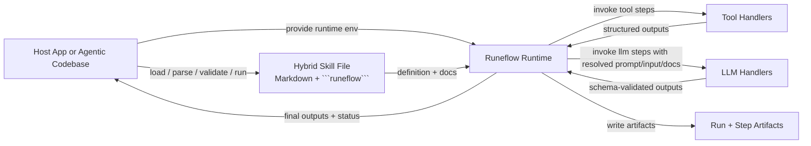

# Runeflow Roadmap: Hybrid Skills

## Summary

Runeflow should continue to treat a skill as one hybrid artifact that combines:

- human-facing Markdown guidance
- a small runtime-owned `runeflow` execution block
- JSON artifacts that make runs and step outputs inspectable

The key product direction is no longer just "make prompt text executable." The next step is to prove that a skill can be a useful combination of execution and text without collapsing back into ad hoc prompt conventions or growing into a heavyweight workflow engine.

This document combines the current retrospective with the active plan and turns them into one forward-looking roadmap.

## What We Learned

### What worked

- The core thesis held up: a skill can be an executable behavior contract, not just reusable prompt text.
- The runtime-owned split was the right boundary. Control flow, validation, retries, branching, and artifacts remained deterministic while the LLM handled bounded generation.
- A single hybrid file worked in practice. Keeping prose and execution together made authoring and inspection easier.
- Built-in local repo tools were enough to make the examples feel real.
- The concept generalized across more than one workflow, which made the idea feel reusable instead of demo-specific.

### What surprised us

- The runtime/LLM boundary became clearer once we ran real examples. The model did not need to understand the Runeflow DSL.
- Live runs helped shape the product story more than static design did.
- The second skill mattered a lot. Once review drafting worked, Runeflow started to look like a pattern rather than a single canned flow.
- Real model integration surfaced practical issues quickly, especially around output shaping and provider behavior.

### What not to build yet

- Do not turn Runeflow into a general orchestration engine.
- Do not add loops, recursion, arbitrary DAGs, hidden scheduling, or parallel execution.
- Do not make the model responsible for parsing or enforcing Runeflow semantics.
- Do not over-invest in DSL flexibility before the most valuable hybrid skill patterns are clearer.

## Product Direction

The working product thesis for the next phase is:

> A useful skill is a hybrid artifact that combines executable runtime behavior with reusable operator text, while keeping the runtime authoritative for execution semantics.

That means we should strengthen both halves of the system:

- execution should stay small, explicit, typed, and inspectable
- text should become a more deliberate and reusable input to execution, not just ambient documentation

## Execution Model

Runeflow should be run by a host application, which may be an agentic codebase. The host decides when to load and run a skill. The Runeflow runtime then owns deterministic execution semantics, while LLM handlers participate only inside bounded `llm` steps.

### Responsibility split

- Host: chooses when to run a skill, loads files, provides tool and LLM handlers, and supplies environment context such as cwd, credentials, and repo state.
- Runeflow runtime: owns control flow, retries, branching, fallback, validation, interpolation, and artifact writing.
- LLM handler: generates bounded outputs for a single `llm` step and does not interpret or enforce Runeflow semantics.

## Roadmap Goals

1. Prove that text-plus-execution skills are meaningfully better than plain Markdown plus a script.
2. Keep the runtime small and easy to evolve during experimentation.
3. Validate the model across several high-value developer workflows before expanding the language.
4. Make runs debuggable enough that operators can see exactly what text, inputs, and outputs drove a result.

## Phase 0.2: Solidify The Current Hybrid Model

This phase keeps the current scope tight and improves the existing PR-prep and review-draft story.

### Deliverables

- Explicit runtime-owned context projection for `llm` steps
- Interpolation support in string-valued fields such as prompts, inputs, tool args, fail messages, and outputs
- Built-in local tool registry available during CLI execution
- Tool metadata and schema discovery for authoring
- Step lifecycle hooks so hosts can observe and intervene around step execution
- A strong flagship local PR-prep workflow
- Better example quality and clearer README positioning

### Execution work

1. Add interpolation support in the binding/expression layer.
   - Exact templates preserve native values.
   - Mixed templates render strings.
   - Validation inspects interpolated references using the same reference checks used for direct expressions.

2. Keep built-in tools small and local-first.
   - `file.exists`
   - `git.current_branch`
   - `git.diff_summary`
   - `git.push_current_branch`
   - `util.fail`
   - `util.complete`

3. Add tool metadata and introspection.
   - Each tool should be able to expose a name, description, input schema, and output schema.
   - The host should be able to provide this metadata for host-owned tools.
   - Runeflow should provide a way to inspect available tools when authoring or validating a skill.
   - Authors should not need to guess the shape of `with` inputs or tool outputs when writing Markdown.
   - This is especially important for non-local tools such as repo, PR, or productivity integrations.
   - Start with an in-repo registry for popular workflows, beginning with GitHub and Linear.
   - Tool steps should eventually be able to reference registry-backed tools directly and omit repeated request and response shape declarations in the Runeflow file.

4. Make the LLM contract explicit and stable.
   - Each `llm` step should receive the step definition, resolved prompt, resolved input, schema, state, projected docs, and definition context.
   - The model should not be expected to parse the Runeflow block.

5. Add host lifecycle hooks around step execution.
   - Add hooks such as `beforeStep`, `afterStep`, and `onStepError`.
   - Hooks should let the host inspect inputs and outputs, request approval, log telemetry, enrich context, or abort a run.
   - Hooks should not make the host responsible for deciding the next step, retry behavior, branch resolution, or fallback semantics.
   - Runeflow must remain the component that drives workflow execution.

6. Improve the flagship examples.
   - Keep PR prep as the primary example.
   - Keep review drafting as the second example.
   - Add explicit no-op or empty-diff handling if it materially improves realism.

### Acceptance criteria

- `validate` passes for the flagship examples
- `run` succeeds with sample runtimes
- artifacts clearly show step inputs, outputs, attempts, errors, and paths
- authors can discover the input and output shape of available tools without reading implementation code
- hook behavior is sufficient for approvals, telemetry, and policy checks without moving orchestration back to the host
- the story "one hybrid file is better than prompt text alone" feels obvious in examples

### Tool metadata principles

- Tool contracts should be discoverable, not implicit.
- Input and output shape should be available to both humans and host tooling.
- Tool metadata should work for built-in tools and host-provided tools.
- Tool metadata should be authoritative enough that a tool step can derive its contract from the registry rather than forcing authors to restate it.
- Discovery should stay simple:
  - list tools
  - inspect one tool
  - show input schema, output schema, and description
- This should support workflows like:
  - fetch how many PRs are open in a repository
  - inspect the output shape
  - feed that result into a later step without guessing field names
- The first concrete registry slice should cover GitHub and Linear.
- Preferred long-term authoring shape:
  - declare the tool name
  - provide `with`
  - derive request and response contract from the registry
- Keep explicit step-local output declarations only if they add real value, such as narrowing, renaming, or documenting intentional projection.

### Hook design principles

- Hooks are intervention points, not orchestration points.
- The host may observe, approve, enrich, pause, or abort.
- Runeflow still owns sequencing, retries, branching, fallback, and validation.
- Hook payloads should include enough context to drive UI and policy decisions:
  - run id
  - step id and kind
  - resolved prompt and input when relevant
  - outputs or error details
  - attempt number
  - artifact paths when available

## Phase 0.3: Make Text First-Class

Once the current hybrid model is solid, the next milestone should make the text side of a skill more explicit and reusable.

### Goal

Treat operator text as structured, selectable runtime context rather than only one large Markdown blob.

### Deliverables

- Named or addressable text blocks inside a skill
- Step-level text projection so a step can select which guidance it receives
- Artifact visibility into which text was projected to which step
- Validation for missing or ambiguous text references

### Why this matters

Today the Markdown/docs portion is valuable, but it is mostly ambient. If skills are going to be a combination of execution and text, then the text should become a deliberate part of the runtime contract.

### Constraints

- Do not introduce a heavy templating system yet.
- Do not require the LLM to understand document structure beyond what the runtime projects.
- Keep the authoring model readable in raw Markdown.

## Phase 0.4: Add Lightweight Skill Composition

If first-class text projection proves useful, the next step is to support reuse across skills.

### Goal

Allow small, explicit composition of reusable text guidance and reusable execution patterns.

### Deliverables

- Minimal include/import support for text fragments or shared skill sections
- Reusable execution snippets only if they remain simple and inspectable
- Validation for import resolution and reference boundaries
- Clear artifact traces showing where imported content came from

### Constraints

- Prefer includes over inheritance
- Prefer explicit resolution over magic merging
- Avoid deep abstraction or macro systems

## Validation Through Example Skills

We should judge the roadmap by whether it produces a small set of compelling skills, not by how much language surface area it adds.

Recommended skill set:

1. Execution-heavy: local PR preparation
2. Balanced: review drafting or issue-to-plan
3. Text-heavy: release notes, incident summary, or another writing workflow with reusable team guidance

If the same hybrid model works across those three shapes, the product thesis gets much stronger.

## Tooling And Operator UX

Independent of language growth, operator tooling should improve in parallel.

### Recommended improvements

- CLI inspection for resolved step prompt, input, and projected docs
- Better error messages for reference and schema failures
- Easier run inspection for step artifacts and final outputs
- Example runtimes that clearly show the LLM contract

These improvements help validate the product without increasing runtime complexity.

## Prototype Posture

Runeflow is still a prototype, not an alpha product. The roadmap should optimize for learning speed and clarity of the model, not for external API stability.

That means:

- do not let compatibility concerns block useful simplification
- keep public naming and aliases only where they are cheap and helpful
- be willing to rename or remove draft surfaces if the hybrid model becomes clearer
- prefer a smaller, sharper prototype over a broader but harder-to-change contract

The main thing to preserve during this phase is not the exact API surface. It is the core architectural split:

- the host decides when to run a skill
- the Runeflow runtime owns execution semantics
- the LLM participates only inside bounded generation steps
- artifacts keep runs inspectable

## Success Criteria

This roadmap is succeeding if:

- new users can understand the hybrid model quickly
- examples feel like real operator tools, not toy workflows
- text and execution each have a clear role in the system
- runtime behavior stays deterministic and inspectable
- Runeflow feels necessary for a small set of workflows, not merely interesting

## Open Questions

- What is the smallest first-class text feature that materially improves the authoring model?
- Which workflows best prove the value of hybrid text-plus-execution skills?
- At what point does composition help more than it hurts readability?
- What should be visible in artifacts to make step context fully debuggable without overwhelming users?

## Near-Term Recommendation

Focus next on finishing and sharpening the current 0.2 execution model, then immediately test one small text-first extension. The next milestone should not be "more workflow power." It should be "make the text side of a hybrid skill explicit enough that reuse and projection become genuinely useful."
